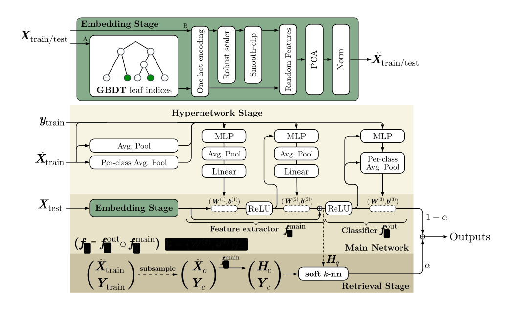

# iLTM: Integrated Large Tabular Model

[](https://badge.fury.io/py/iltm)
[](https://github.com/AI-sandbox/iLTM/blob/main/LICENSE)
[](https://pypistats.org/packages/iltm)
[](https://pypi.org/project/iltm/)
[](https://huggingface.co/dbonet/iLTM)


iLTM is a foundation model for tabular data that integrates tree-derived embeddings, dimensionality-agnostic representations, a meta-trained hypernetwork, multilayer perceptron (MLP) neural networks, and retrieval. iLTM automatically handles feature scaling, categorical features, and missing values.

We release open weights of pre-trained model checkpoints that consistently achieve superior performance across tabular classification and regression tasks, from small to large and high-dimensional tasks.



### Install

iLTM is accessed through Python. You can install the package via pip:
```
pip install iltm
```

iLTM works on Linux, macOS and Windows, and can be executed on CPU and GPU, although GPU is **highly recommended** for faster execution.

Pre-trained model checkpoints are automatically downloaded from [Hugging Face](https://huggingface.co/dbonet/iLTM) on first use.
By default, checkpoints are stored in platform-specific cache directories (e.g., `~/.cache/iltm` on Linux, `~/Library/Caches/iltm` on macOS).
You can specify where model checkpoints are stored by setting the `ILTM_CKPT_DIR` environment variable:

```bash
export ILTM_CKPT_DIR=/path/to/checkpoints
```

> [!NOTE]
> The first call to `iLTMRegressor` or `iLTMClassifier` downloads the selected
> checkpoint. Later runs reuse the cached weights from `ILTM_CKPT_DIR` or the
> default cache location.

> [!TIP]
> For interactive work on a local machine it is often worth pointing
> `ILTM_CKPT_DIR` to a fast local disk to avoid repeated downloads across
> environments.

### Quick Start

iLTM is designed to be easy to use, with an API similar to scikit-learn.

```py
from iltm import iLTMRegressor, iLTMClassifier

# Regression
reg = iLTMRegressor().fit(X_train, y_train)
y_pred = reg.predict(X_test)

# Classification
clf = iLTMClassifier().fit(X_train, y_train)
proba = clf.predict_proba(X_test)
y_hat = clf.predict(X_test)

# With time limit (returns partial ensemble if time runs out)
reg = iLTMRegressor().fit(X_train, y_train, fit_max_time=3600)  # 1 hour limit
```

### Model Checkpoints

Available checkpoint names:
- `"xgbrconcat"` (default): Robust preprocessing + XGBoost embeddings + concatenation
- `"cbrconcat"`: Robust preprocessing + CatBoost embeddings + concatenation
- `"r128bn"`: Robust preprocessing with 128-dim bottleneck
- `"rnobn"`: Robust preprocessing without bottleneck
- `"xgb"`: XGBoost embeddings only
- `"catb"`: CatBoost embeddings only
- `"rtr"`: Robust preprocessing with retrieval
- `"rtrcb"`: CatBoost embeddings with retrieval

You can also provide a local path to a checkpoint file.

Common key args:
- checkpoint: checkpoint name or path to model file. Default "xgbrconcat".
- device: torch device string. Default "cuda:0".
- n_ensemble: number of generated predictors.
- batch_size: batch size for weight prediction and inference.
- preprocessing: "realmlp_td_s_v0" or "minimal" or "none".
- cat_features: list of categorical column indices.
- tree_embedding: enable GBDT leaf embeddings.
- tree_model: "XGBoost_hist" or "CatBoost".
- concat_tree_with_orig_features: concatenate original features with embeddings.
- finetuning: end to end finetuning.
- Retrieval: do_retrieval, retrieval_alpha, retrieval_temperature, retrieval_distance.

Regressor only:
- clip_predictions: clip to train target range.
- normalize_predictions: z-normalize outputs before unscaling.

Classifier only:
- voting: "soft" or "hard".

## Hyperparameter Optimization

iLTM performs best when you tune its hyperparameters.

### Recommended search space

The package exposes a recommended search space via `iltm.get_hyperparameter_search_space`, a plain dictionary that maps hyperparameter names to small specs.

> [!TIP]
> When running hyperparameter optimization with time constraints, you can use the `fit_max_time` parameter in `fit()` to limit training time per configuration. The model will return a partial ensemble if the time limit is reached. 

The checkpoint parameter is part of this space. It is responsible for selecting one of the built in model checkpoints, which in turn sets other fields such as `preprocessing`, `tree_embedding`, and others.

The specification format is intentionally minimal so that it can be re-used in any hyperparameter optimization library or custom tuning procedure.


- `iltm.get_hyperparameter_search_space()` gives you the canonical space definition.
- `iltm.sample_hyperparameters(rng)` draws a single random configuration from that space for quick baselines and smoke tests.

> [!TIP]
> `sample_hyperparameters` is mainly intended for quick baselines, smoke
> tests, or simple random search. For more serious tuning runs it is
> usually better to adapt the search space from
> `get_hyperparameter_search_space` into your optimization method of
> choice, and let that method decide which configurations to try.


## Development

### Running Tests

To run the tests:

```bash
uv pip install -e ".[dev]"
pytest tests/
```

## Citation

If you use iLTM in your research, please cite our paper:

```bibtex
@article{iltm2025,
  title={iLTM: Integrated Large Tabular Model},
  author={Bonet, David and Comajoan Cara, Marçal and Calafell, Alvaro and Mas Montserrat, Daniel and Ioannidis, Alexander G.},
  journal={arXiv preprint},
  year={2025}
}
```

*Note: update with the actual publication details once available.*

## License

© Contributors, 2025. Licensed under an [Apache-2](https://github.com/AI-sandbox/iLTM/blob/main/LICENSE) license.
